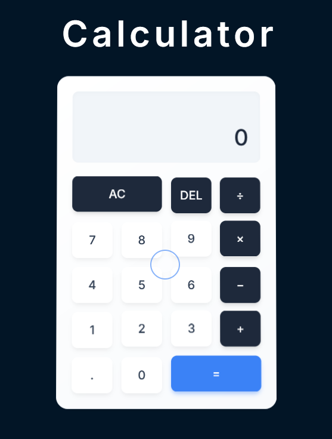

# 🎬 Animated Calculator

A simple yet visually engaging **animated calculator** built using **GSAP** and **Tailwind CSS**.

🌐 **Live Demo**: [animated-calculator-gsap.onrender.com](https://animated-calculator-gsap.onrender.com/)


---

## 🚧 Features

- Responsive layout with Tailwind CSS  
- Smooth animations using GSAP  
- Light/dark mode compatible  
- Clean UI with custom button effects  

---

## 🛠️ Tech Stack

- **HTML**
- **CSS**
- **JavaScript**
- **[GSAP](https://gsap.com/)** (GreenSock Animation Platform)
- **[Tailwind CSS](https://tailwindcss.com/)**

---

## 🚀 Run Locally

Follow these steps to run the project on your local machine:

### 1. Clone the Repository

```bash
git clone https://github.com/saipuneeth2706/Animated-Calculator.git
```
### 2. Change Directory

```bash
cd animated-calculator
```
### 3. Open with a Local Server 
- If you're using **VS Code**, right-click `index.html` and select **"Open with Live Server"**  
Or use Python to serve locally:

```bash
#Python 3
python -m http.server
```
- Then open your browser and go to:  
`http://localhost:8000` 
---
